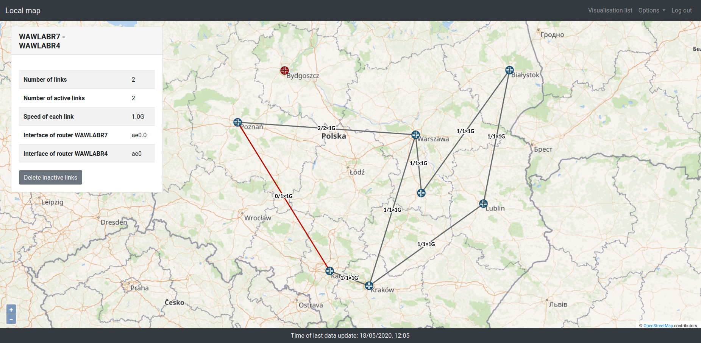

# router-map
The program allows to create map with routers and connections between them. 
Uses data detected by the LLDP protocol, collected on each device. 
Information is taken via SNMP protocol.



## Supported devices
Router-map was tested on networks with Juniper devices MX and SRX with Junos version 12 and newer.


You have to enable LLDP and SNMP protocols on all routers.

Sample of SRX configuration: 

```
snmp {                                  
    name NAME1;                      
    location "20.1265, 52.3283";           
    community snmp_community {                    
        authorization read-only;        
    }                                   
} 
```
## Running with Docker

#### Building & Running
Run application on port 8080:
```
docker-compose -f production.yml up -d
```

To import router data, run (sample file in directory sample-data):
```production
docker-compose -f production.yml run django python manage.py import_router_data 'sample-data/data.csv'
```

To check the logs out, run:
```
docker-compose -f production.yml logs
```


#### Environment variables
Environment variables for postgres database should be defined in file .envs/.production/.postgres

| Variable name         | Description   |  Default value   |
| -------------         |:-------------:|:-------------:|
| POSTGRES_HOST         | Postgres host. | postgres |
| POSTGRES_PORT         | Postgres port. | 5432 |
| POSTGRES_DB           | Postgres database name. | router-map |
| POSTGRES_USER         | Postgres user name. | router-map |
| POSTGRES_PASSWORD     | Postgres user password. | router-map |

Environment variables for django app should be defined in file .envs/.production/.django

| Variable name             | Description |  Default value   |
| -------------             |:-------------:|:-------------:|
| DJANGO_SETTINGS_MODULE    | Should be set to 'config.settings.production' for production or to 'config.settings.local' for local development. | config.settings.production |
| DJANGO_SECRET_KEY         | Should be set to a unique value. It is used by django to provide cryptographic signing.| gtOQBX7rlOtY1A7 |
| DJANGO_ALLOWED_HOSTS      | A list of strings representing the host/domain names that this Django site can serve. To match anything set value '*'. | * |
| WEB_CONCURRENCY           | Number of gunicorn workers. | 4 |
| REDIS_URL                 | Redis URL (Redis is used as Celery broker). | redis://redis:6379/0 |
| REDIS_HOST                | Redis host. | redis |
| TASK_PERIOD               | Period of time between router connection checks in minutes.| 15 |
| CELERY_FLOWER_USER        | Celery flower user name. | router-map |
| CELERY_FLOWER_PASSWORD    | Celery flower user password. | router-map |

### CSV file with router data
CSV file is needed to add router data into database . 
Location data of each router can be added in file or checked via snmp.

Every line describes one router and contains the following fields separated by comma: name, ip address, snmp community, longitude(optional), latitude(optional).
If longitude and latitude are ommited, they have to be included in device configuration.


example of csv with location
```
router_name,1.1.1.1,snmp_community,12.54,15.523
```
example of csv without location
```
router_name_1,1.1.1.1,snmp_community
router_name_2,1.1.1.1,snmp_community
```

